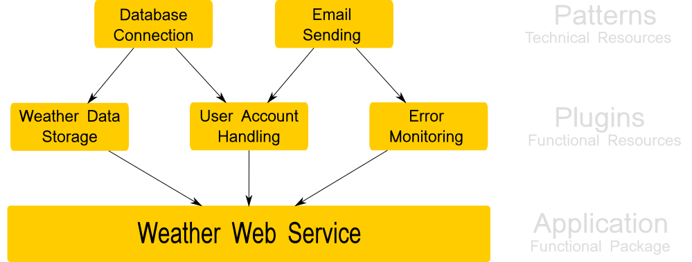

Architecture
============

A groundwork application knows 3 levels of abstraction: :ref:`applications <application>`, :ref:`plugins <plugins>` and
:ref:`patterns <patterns>`.

These three levels were chosen to reflect the need of functional and technical separation. Additionally, it allows
granular code reuse and recombination.

Definitions
-----------

Application
~~~~~~~~~~~
An :ref:`application <application>` bundles several functionalities, which are provided by :ref:`plugins <plugins>`.

Therefore, an :ref:`application <application>` is a package of :ref:`plugins <plugins>` and has one or several functional
focuses. Like a web app for weather services or a console script for text file manipulation.

Plugin
~~~~~~
A :ref:`plugin <plugins>` has a strongly user oriented functional focus. Examples are user account handling, error
monitoring or functions for viewing log files.

It may also provide some sort of user interface, like console commands or web pages.

If a plugin needs technical resources like a database connection, a web server or command registration, it needs to use
:ref:`patterns <patterns>`.

A plugin can be activated and deactivated during application runtime.

Pattern
~~~~~~~
A :ref:`pattern <patterns>` provides technical resources to :ref:`plugins <plugins>`.
They are responsible for setting up database connections, providing APIs for command registration or web route
handling.

A plugin uses patterns by deriving from pattern classes. Several patterns can be invoked by using multi inheritance.
Thus, patterns are strongly coupled with related plugins during application runtime.

Patterns become automatically activated as soon as an application activates the first plugin that inherits from
the pattern. A pattern gets automatically deactivated, if all plugins are deactivated, which inherit from the pattern.
With plugins deriving from patterns, the plugin activation order becomes unimportant because resources provided
by patterns will already be registered on the app if the first plugin wants to use it. This is important for
functionality like database connections or web frameworks which are commonly only instantiated once but used
for multiple plugins.

Example
-------

The following image shows an application example for a weather web service. The service has 3 main features:

 * Provide weather information. Data source is a database.
 * Allow user registration, in which users are stored to the database and then receive a welcome email.
 * Error handling. Service administrators shall get emails if problems occur.




The 3 features are separated into 3 plugins having a use case related focus: weather storage,
user handling and error monitoring.

All plugins need a total of 2 technical resources: A database and a way to send emails.
These are realised by 2 different patterns: a database connection pattern and an email sending
pattern.

The application itself is configured to load the 3 plugins during startup. The related patterns are getting
loaded and configured automatically.

Code examples
~~~~~~~~~~~~~
The following code snippets give a first impression how such an architecture can be
realised.

patterns.py
```````````
The following code defines the 2 patterns for database connections and email sending::

    from groundwork.patterns import GwBasePattern


    class DatabasePattern(GwBasePattern):
        def __init__(self):
            self.database = Database()  # Database has functions: store(), get()


    class EmailPattern(GwBasePattern):
        def __init__(self):
            self.email = Email()   # Email has functions: send()

plugins.py
``````````
The 3 features are realised by the following 3 plugins::

    from .patterns import DatabasePattern, EmailPattern


    class WeatherStorePlugin(DatabasePattern):
        def __init__(self, app, **kwargs):
            self.name = "Weather Store"
            super().__init__(app, **kwargs)

        def activate(self):
            self.database.store(MyWeatherData)

        def get_weather(location):
            return self.database.get(location)

        def deactivate(self):
            pass


    class UserHandling(DatabasePattern, EmailPattern):
        def __init__(self, app, **kwargs):
            self.name = "User Handling"
            super().__init__(app, **kwargs)

        def register_user(self, username, email):
            self.database.store(User(username, email))
            self.email.send(email, "Welcome %s" % username)

        def deactivate(self):
            pass


    class ErrorMonitoring(EmailPattern):
        def __init__(self, app, **kwargs):
            self.name = "Error Monitoring"
            super().__init__(app, **kwargs)

        def activate(self):
            self.admin = "admin@my_company.com"

        def error_detected(traceback):
            self.email.send(self.admin, "Error found! %s" % traceback)

        def deactivate(self):
            pass

app.py
``````
The application itself only needs to load the three plugins::

    from groundwork import App
    from .plugins import WeatherStorePlugin, UserHandling, ErrorMonitoring

    # Load application and register plugins
    my_app = App(plugins=[WeatherStorePlugin, UserHandling, ErrorMonitoring])

    # Activate plugins
    my_app.activate(["Weather Store", "User Handling", "Error Monitoring"])

