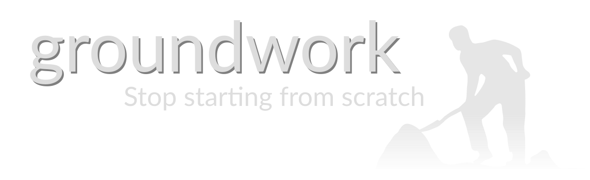

.. image:: https://img.shields.io/pypi/l/groundwork.svg
   :target: https://pypi.python.org/pypi/groundwork
   :alt: License
.. image:: https://img.shields.io/pypi/pyversions/groundwork.svg
   :target: https://pypi.python.org/pypi/groundwork
   :alt: Supported versions
.. image:: https://readthedocs.org/projects/groundwork/badge/?version=latest
   :target: https://readthedocs.org/projects/groundwork/
.. image:: https://travis-ci.org/useblocks/groundwork.svg?branch=master
   :target: https://travis-ci.org/useblocks/groundwork
   :alt: Travis-CI Build Status
.. image:: https://coveralls.io/repos/github/useblocks/groundwork/badge.svg?branch=master
   :target: https://coveralls.io/github/useblocks/groundwork?branch=master
.. image:: https://img.shields.io/scrutinizer/g/useblocks/groundwork.svg
   :target: https://scrutinizer-ci.com/g/useblocks/groundwork/
   :alt: Code quality
.. image:: https://img.shields.io/pypi/v/groundwork.svg
   :target: https://pypi.python.org/pypi/groundwork
   :alt: PyPI Package latest release

Welcome to groundwork
=====================

| groundwork is a Python based microframework for highly reusable :ref:`applications <application>` and their components.
| Its functionality is based on exchangeable, well-documented and well-tested :ref:`plugins <plugins>` and :ref:`patterns <patterns>`.

It is designed to support any kind of a Python application: command line scripts, desktop programs or web applications.

groundwork enables applications to activate and deactivate plugins during runtime and to control dynamic plugin
behaviors like plugin status, used signals, registered commands and much more.

| The functionality of plugins can easily be extended by the usage of inheritable patterns.
| Thus, groundwork supports developers with time-saving solutions for:

 * :ref:`Command line interfaces <commands>`
 * Loose inter-plugin communication via :ref:`signals and receivers <signals>`
 * :ref:`Shared objects <shared_objects>` to provide and request content to and from other plugins
 * Static and dynamic :ref:`documents <documents>` for an overall documentation

Additional, ready-to-use solutions can be easily integrated into groundwork applications by the usage of third-party
plugins and patterns from the groundwork community
(like `groundwork-database <https://groundwork-database.readthedocs.io>`_
or `groundwork-web <https://groundwork-web.readthedocs.io>`_ ). See :ref:`packages` for more information.

Example
-------

The following code defines a plugin with command line support and creates a groundwork :ref:`application <application>`,
which activates the :ref:`plugin <plugins>`: ::

    from groundwork import App
    from groundwork.patterns import GwCommandsPattern

    class MyPlugin(GwCommandsPattern):
        def _init_(self, app, *args, **kwargs):
            self.name = "My Plugin"
            super().__init__(app, *args, **kwargs)

        def activate(self):
            self.commands.register(command='hello',
                                   description='prints "hello world"',
                                   function=self.greetings)

        def greetings(self):
            print("Hello world")

    if __name__ == "__main__":
        my_app = App(plugins=[MyPlugin])        # Creates app and registers MyPlugin
        my_app.plugins.activate(["My Plugin"])  # Initialise and activates 'My Plugin'
        my_app.commands.start_cli()             # Starts the command line interface

The following commands can be used on a command line now::

    python my_app.py hello      # Prints 'Hello world'
    python my_app.py            # Prints a list of available commands
    python my_app.py hello -h   # Prints syntax help for the hello command

Tutorial
--------
For the case you wish a more use-case oriented introduction into groundwork, we have set up a
`tutorial <https://useblocks.github.io/groundwork-tutorial>`_ with a huge amount of code examples.

This tutorial starts with the groundwork basics, lets you create your first groundwork command line application, gives
introductions how to add database support and finally ends with your own groundwork based web application.

Beside groundwork itself, it also uses the community packages
`groundwork-database <https://groundwork-database.readthedocs.io>`_
and `groundwork-web <https://groundwork-web.readthedocs.io>`_.

The tutorial is available under
`useblocks.github.io/groundwork-tutorial <https://useblocks.github.io/groundwork-tutorial>`_.

User's Guide
------------

.. toctree::
   :maxdepth: 2

   foreword
   installation
   quickstart
   architecture
   application
   plugins
   patterns
   signals
   commands
   shared_objects
   documents
   threads
   recipes
   packaging
   packages
   contribute

API Reference
-------------

.. toctree::
   :maxdepth: 2

   api

